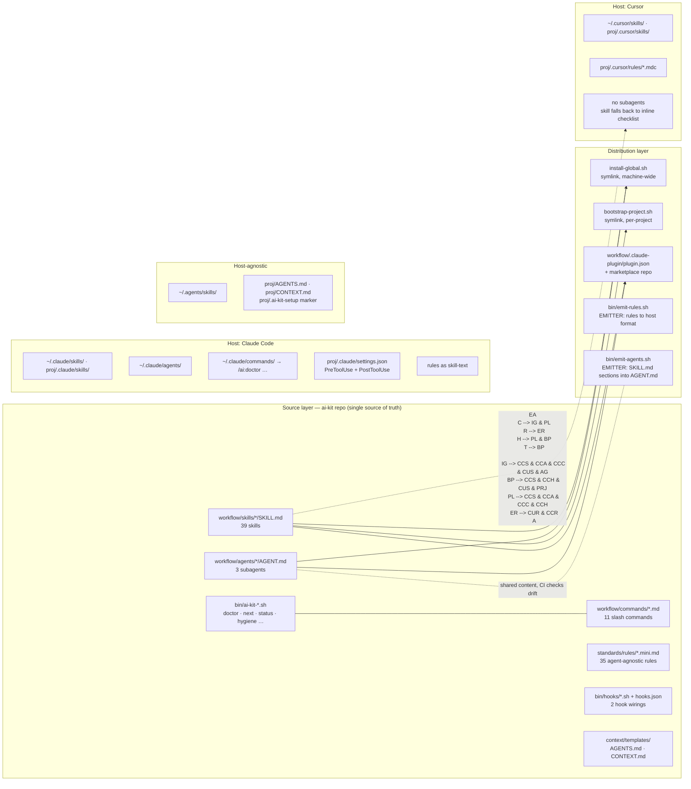
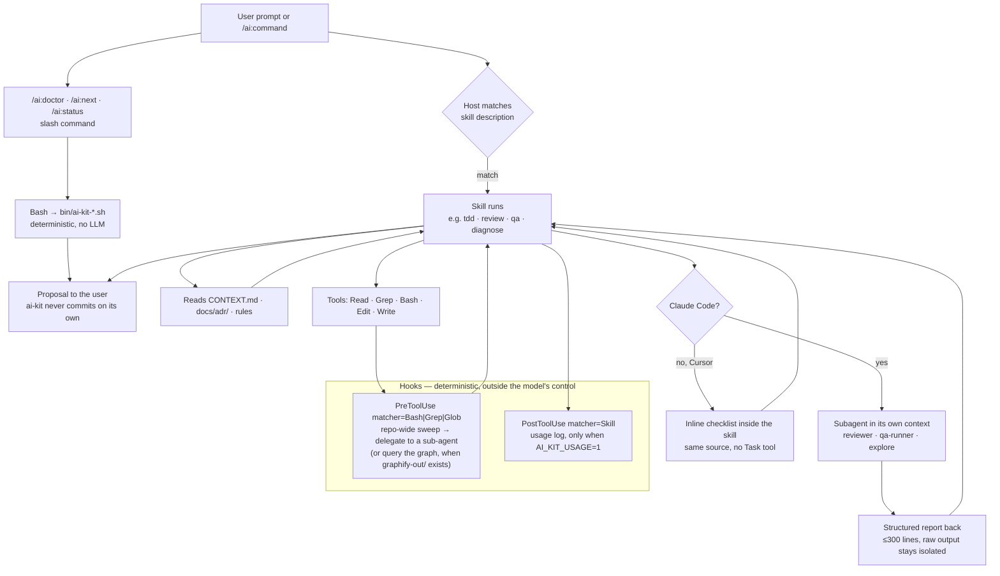

# Diagrams

Two views of the same kit. The first shows how primitives *reach* a host; the
second shows what happens *during* a turn. For the prose version see
[architecture.md](architecture.md) (wiring) and [mental-model.md](mental-model.md)
(skill choreography).

## Wiring — how a primitive reaches the host

Two rules carry the whole tree: **symlinks, not copies** — a `git pull` in the
source layer updates every host at once — and **emitters** for anything that
cannot be symlinked, either because each host wants a different format (rules)
or because the artifact shares content with another one (agent ← skill).

One exception the diagram flattens: `workflow/bin/` is a *copy* of `bin/`, not a
symlink, because the plugin must be self-contained under `${CLAUDE_PLUGIN_ROOT}`.
`bin/sync-plugin-bin.sh` keeps the two in step and CI fails on drift. Editing a
script under `bin/` therefore means re-running that sync.

## Runtime — what happens in one turn

## One line per primitive

- **Skill** — a workflow with a `description:` the model routes to on its own.
  The only primitive the LLM picks autonomously.
- **Subagent** — the same workflow in its own context window, so browser and
  grep output never reaches your main context. Claude Code only; Cursor gets the
  inline variant emitted from the same source.
- **Slash command** — a thin wrapper around a bash script. No LLM decision, so
  the output is reproducible.
- **Hook** — the only layer guaranteed to run regardless of what the model
  decides. That is why the search-delegation nudge lives here and not in a rule:
  `context-discipline` already *says* "delegate wide exploration", but a rule is
  prose the model skips under pressure. The hook fires anyway — and only on a
  repo-wide sweep, so a scoped `Grep` stays silent and the nudge stays signal.
- **Rule** — cross-cutting guidance with no trigger, emitted to host format at
  `/ai:setup` time.
- **Tool** — what a skill has in hand (Read/Bash/Edit). Provided by the host,
  not defined by ai-kit.

Rule of thumb from [architecture.md](architecture.md): if the answer is "two of
these at once", one is primary and the other should defer to it.
