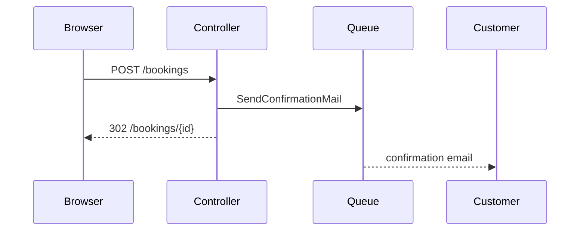

# Show me

A paragraph describing a call chain is slower to read than the call chain. When
the answer has shape, draw the shape.

Pick **one** view, the smallest that answers the question actually asked. Two
views are sometimes right. All of them never is.

## Pick the view

| The question is about | Draw |
| --------------------- | ---- |
| What happens at runtime, in what order | Call tree |
| What renders, and where state lives | Component tree |
| Which file owns what | Shallow file tree |
| A rule or algorithm, not its syntax | Pseudocode |
| What changes, when the surrounding shape already exists | Diff |
| Who talks to whom, over time or across a boundary | Mermaid |
| A layout, a state comparison, or something too dense for Mermaid | One HTML page |

### Call tree

Indentation is the call. Nothing else.

```text
store()
  validateRequest()
  Booking::create()
    fireBookingCreated()
      SendConfirmationMail (queued)
  redirectToShow()
```

### Component tree

Include the path of the entry point, the hooks or composables that own state,
and the package boundary when one is crossed. Leave out the rest.

```text
<BookingPage> (resources/js/Pages/Booking/Show.vue)
  useBookingState()
  <BookingHeader>
  <SlotPicker>          (resources/js/Components)
    <SlotButton> xN
```

### Shallow file tree

One level, with a comment per directory saying what it owns. If you need two
levels, the question was about something else.

```text
app/
├── Actions/        # one public method per use case
├── Models/         # Eloquent, no business rules
└── Support/        # framework-free helpers
```

### Pseudocode

For a rule, a guard, or a state transition. Drop the language.

```text
on(cancel)
  if booking already started
    refuse
  if within free window
    refund in full
  else
    refund minus fee
  release the slot
```

### Diff

Reach for this when the point is the change, not the whole. Match the diff to
whatever shape you would otherwise have drawn, so a diff of a call tree is a
call tree, and a diff of a file layout is a file layout.

```diff
 store()
   validateRequest()
   Booking::create()
+    assertSlotStillFree()
     fireBookingCreated()
```

```diff
 app/
 ├── Actions/
+│   └── CancelBooking.php
-└── Services/BookingService.php
+└── Support/
```

### Mermaid

For interaction across a boundary, or state with more than three transitions.
Mermaid renders on GitHub, so it stays the in-repo source of truth.



### One HTML page

Only when the point is visual and Mermaid cannot carry it: a layout, a
before/after of a UI, a dense comparison, a short deck. Use the project's own
colours, type and spacing, use real labels and real data, and make it work on a
phone.

Write it to the OS temp directory so nothing lands in the repo. Resolve the temp
dir from `$TMPDIR`, falling back to `/tmp` (or `%TEMP%` on Windows), and write to
`<tmpdir>/show-me-<description>-<timestamp>.html` so each run gets a fresh file.
Open it for the user, `xdg-open <path>` on Linux, `open <path>` on macOS, `start
<path>` on Windows, and tell them the absolute path.

That location is not a detail. The page carries the project's real data, and a
file written to the repo root is one `git add -A` from being committed.

Do not build a page when a tree would do. The HTML branch is the expensive one.
If the user needs to click through it rather than read it, that is `prototype`,
not this skill.

## Rules

1. **Next to the text, not instead of it.** One or two sentences of prose carry
   the point. The picture carries the shape.
2. **Only what the question needs.** Every extra call, file, prop or state you
   draw is a thing the reader has to rule out. A tree with three nodes that
   answers the question beats a complete one that does not.
3. **Real names.** Paths, classes and props from this repo. A diagram of
   `ServiceA -> ServiceB` teaches nothing.
4. **No preamble.** Do not announce the diagram. Draw it.
5. **Say what you left out** when you truncated something the reader might
   otherwise assume is complete.

For publication-quality exports of an in-repo Mermaid source, the `diagram-design`
plugin in `standards/external/plugins.json` is the renderer. Keep Mermaid as the
source of truth either way.

## Provenance

The set of views and the "smallest view that makes the point" rule are distilled
from [humanlayer/skills](https://github.com/humanlayer/skills), plugin
`show-me`, MIT, Copyright (c) 2026 HumanLayer, read at commit
`3c2629142c5d437428269b1b722b08c0b87f574d`.

This is a reimplementation, not a copy. The text, the decision table, the rules
and the examples are ai-kit's and stay under ai-kit's MIT licence, so this file
is deliberately absent from `standards/external/vendored.json`, which tracks
verbatim copies that upstream drift should chase.

## Usage logging (opt-in)

When `AI_KIT_USAGE=1` is set, log the invocation so `retro` can spot patterns:

```bash
bash "$AI_KIT_ROOT/bin/log-skill.sh" show-me start  # at the start
bash "$AI_KIT_ROOT/bin/log-skill.sh" show-me done   # at the end (or `abort` if you bail)
```

Silent no-op when the env var is unset. See [SECURITY.md](../../../SECURITY.md) for what is logged and where.
